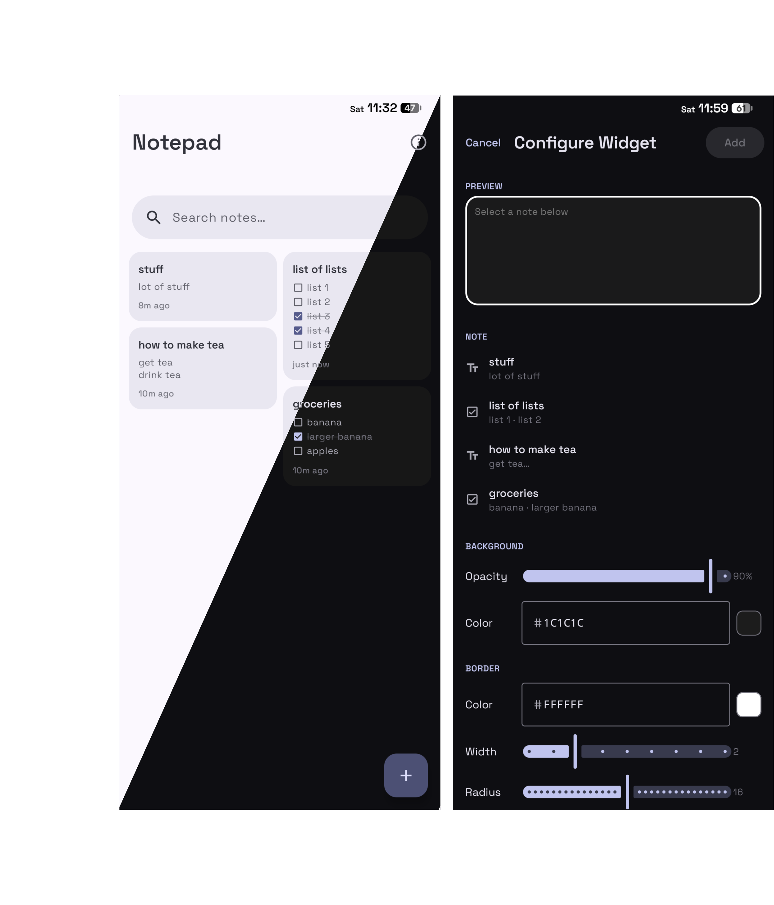

# Notepad

A simple, clean notepad app for Android built with Kotlin and Jetpack Compose.



## Features

- Text notes and checklists
- Pin notes
- Search
- Light, dark, and AMOLED themes
- Customizable Widgets

## Installation

> [!NOTE]
> Android versions from 8 to 16 are currently supported

- goto [latest release](https://github.com/quantumvoid0/notepad/releases/latest) and download the [notepad.apk](https://github.com/quantumvoid0/notepad/releases/download/v1.1/notepad.apk), after doing so open `notepad.apk` to install it.

## Building yourself for development

Requirements:
- JDK 17
- Android SDK (API 36)

```bash
git clone https://github.com/quantumvoid0/notepad
cd notepad
gradle wrapper --gradle-version 8.14.2
./gradlew assembleDebug
adb install app/build/outputs/apk/debug/app-debug.apk
```
